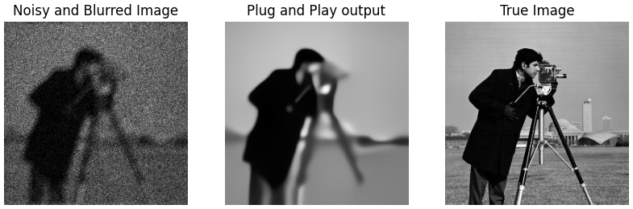

# Poisson-Plug-and-Play
## _Non Official_ Python Implementation for ["Poisson Inverse Problems by Plug-and-Play"](https://arxiv.org/abs/1511.02500)
### Instructions
Before running demo.py, download the pre-trained DnCNN file 'dncnn_15.pth' from this [link](https://github.com/cszn/KAIR/releases/tag/v1.0)

### Result after running demo.py:

